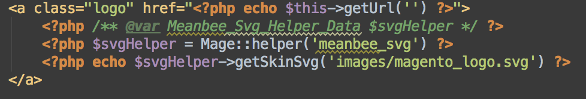

# Meanbee SVG

Simple module that adds a helper that allows you to read in SVG files from the media or skin folder of current theme.  

## Example Code

Load helper, pass in relative directory path to `getSkinSvg()` or `getMediaSvg()` and echo the results

 
